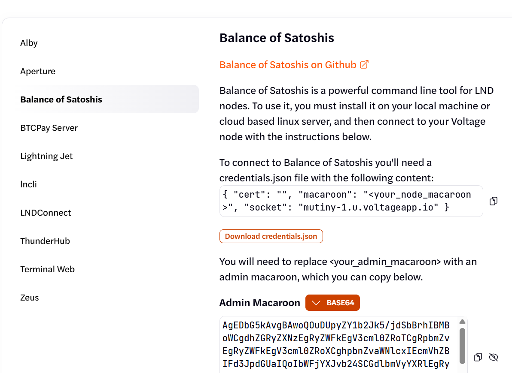
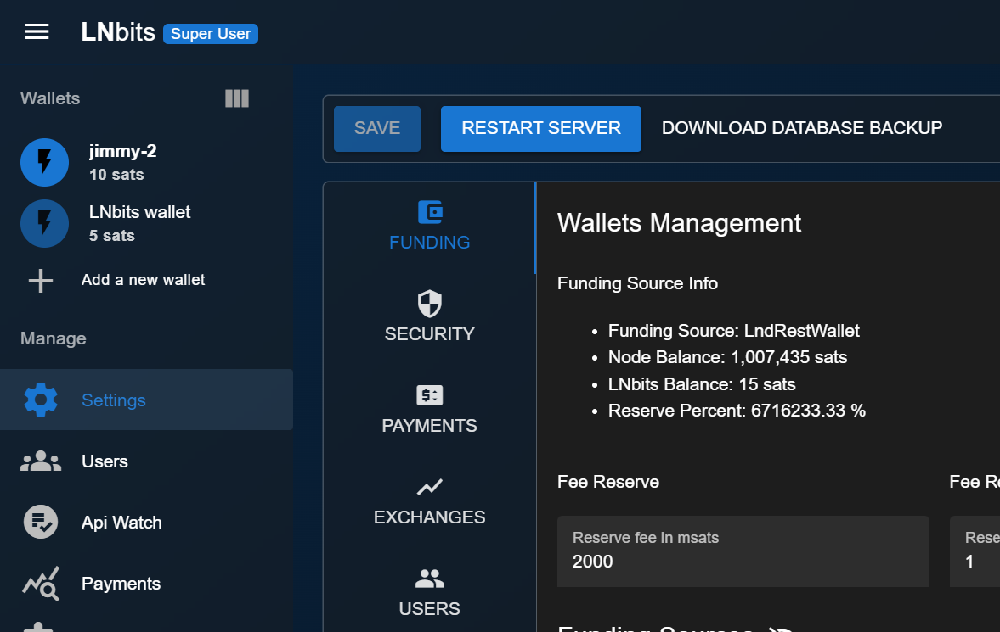

# Setup LNBits on MutinyNet

_March 27, 2025_

This will allow you to build Lightning Network Apps ("L-Apps") without putting real funds at risk. And then convert that app to real Bitcoin/Lightning.

Tutorial for the MIT Bitcoin Hackathon 2025. Register [here](https://mitbitcoin.devpost.com/) to participate and head to the discord to ask questions.

In this tutorial we will setup **LNBits** and connect to Voltage lightning node running on **MutinyNet**. Then building our own app to send/recieve lightning payments based on the **LNBits API**.

**LNBits can be used to:**
- Request and Send payments
- Create separate wallet for each user/object
- Every action is available via a simple [API](https://v1.lnbits.com/docs)

**MutinyNet is used to:** 
- Allow you to experiment with lightning without using real bitcoin

### Expectations:
- **In this tutorial you will learn:** 
    - how to get onto a testnet, 
    - transact on the testnet in the browser, 
    - build a simple python app which transacts in a website.
- **Pre-Requisites:**
    - no prior bitcoin/lightning experience
    - some familiarity with coding is helpful
    - no installs or computer setup needed if you chose the repl.it track, so you'll need a (free-version) [repl.it](https://repl.it) account
    - *=_or_ run a docker container locally track so you'll need docker installed locally for this one
- **Duration:** 
    - 45 minute - Setup
    - 45 minute - Hello world demo

_**Following Along:** If you are doing this tutorial live (online or in-person at the hackathon) we'll send you testnet coins when you're setup._

_But if you are following this tutorial before/after the hackathon you'll need a slightly more complicated setup to get those coins yourself, head over here for those [instructions](./two-node-setup.md)_

---

# Setup 
_45 mins_
## Create account on voltage
- Sign-up for Voltage: https://www.voltage.cloud/
- We will only be using **free services**
- Later on you can convert this same setup to real bitcoin "mainnet" with a flip of a variable and adding real bitcoin onto your node [0]
### Create a Mutinynet Node
- These should be available for zero compute credits so you can create them for free.
- This will take ten minutes to sync with the chain so let's get that out of the way.
- Note bene: you may notice there is button on this admin page which says "Launch LNBits" which looks appealing. Unfortunately this button doesn't work on testnet
#### Coins & Channels
- Unlock your node via the unlock button in top right and entering your password
- Click 'get coins' and 1M fake sats, wait for confirm
- Click open channel, push 25% across the node [1](#footnotes), wait for confirm
- Repeat for other node
- Here's a guide that's a little out-of-date[2](#footnotes): https://docs.voltage.cloud/dev-sandbox-mutinynet

## Run LNBits on replit - `Track1`

- Use this option if you are less comfortable running Git and Docker on your own computer, if you chose this section head over to the insturctions here: [replit-setup.md](./replit-setup.md)

## Run LNBits locally with Docker - `Track2`
- Clone down LNBits: https://github.com/lnbits/lnbits
```bash
git clone git@github.com:lnbits/lnbits.git 
```
- The main branch ("dev") should work fine, current version is ~`1.0.0rc9`

### Run with Docker
- Build the image with docker
```bash
docker build -t local/lnbits .
```
- Make a persistence volume in project root: `mkdir data`
- Copy the `.env.example` at root to `.env`:
- run with docker per project's [instructions](https://github.com/lnbits/lnbits/blob/main/docs/guide/installation.md#option-4-docker): (Note this assumes you are running this command from the project root.)
```bash
docker run \
    --detach \
    --name lnbits-mutiny-1
    --publish 5000:5000 \
    --volume ${PWD}/.env:/app/.env \
    --volume ${PWD}/data/:/app/data \
    local/lnbits
```
- Remember this command needs to be run from project root due to the `PWD` variable.
- Verify it works: it should be available on http://localhost:5000
- Create an admin user and password, 
    we suggest just user: user, password: password
- You should now see a wallet.
- You should be in Admin Setup View in VoidWallet mode.
    - You should see "VoidWallet" warning in the top right. We'll fix that next.
- Grab your `usr` id from Top Right > My Account > Account Settings > User ID. Paste this somewhere in case your browser logs you out.

### Connect LNBits to node on voltage
We want to get the following settings to fill for the next section: `LND_REST_ENDPOINT`,`LND_REST_MACAROON`, and `LND_REST_CERT`.
  - the cert is not necessary but you may experience degraded performance without it. Let's try with it blank to start.

#### Find connection settings on voltage admin
- Unlock you admin panel:
    - in the top right find the 🔓 icon and enter your node's password.
    - wait a couple seconds for the obscure content to become visible
- Get the REST Endpoint:
    - On the right panel, find you `API Endpoint` it should look something like: mutiny-1.u.voltageapp.io
    - Add this to `LND_REST_ENDPOINT`
- Get the Admin Macaroon:
    - On left Voltage Admin panel go to left sidebar go:
        - _Manage Access_ > _App Instruction_ > _Balance of Satoshis_
    - Hit the eye icon next to "****" values to view 
    - get the macaroon in `base64` format (not `hex`)
    - Add this to `LND_REST_MACAROON`


- Note bene: we're not installing Balance of Satoshis but using the same macaroon for LNBits.

>A helpfule guide with more visuals is [here](https://docs.voltage.cloud/dev-sandbox-mutinynet).

#### Modify `.env`
Find where these settings live and comment out the initial values, fill them with your new settings
```bash
LND_REST_ENDPOINT="<subdomain.domain:port>" # my-node-name.u.voltageapp.io:8080
LND_REST_CERT=""  # deliberate blank string
LND_REST_MACAROON="AgEDbG5kAvgBAwo...="  # paste your full one here
```

#### Re-run the docker with modifications:
```bash
docker stop lnbits-mutiny-1  # should take ~20 secs to shutdown
docker start lnbits-mutiny-1  # should take ~20 secs to startup
```

#### Verify its working:
- Head back to `http://localhost:5000/` Verify the site loads.
- Now you'll perform several actions outlined ion more detail in the section below[`#WebUI`](#webui---using-lnbits-in-the-browser).
    - Now create a wallet and give it a name.
    - Now create an invoice. 
- This verifies that your locally running lnbits is connecting to your Lightning Node running on a Voltage server [3].


#### Debug if nec.
If everything's working, you can move to the next section. Otherwise here's a few things to check:
<details>
<summary>
<b>Logs</b>
</summary>
Running `docker logs lnbits-mutiny-1` should produce logs and you can search for this section:
- Note how there are multiple attempts to connect to the backend before it succeeds. This is expected behavior and we see in this case it does eventually connect.

```bash
2025-03-28 02:42:48.61 | WARNING | No certificate for LndRestWallet provided! This only wor
ks if you have a publicly issued certificate.
2025-03-28 02:42:48.64 | INFO | Connecting to backend LndRestWallet...
2025-03-28 02:42:53.65 | WARNING | 
2025-03-28 02:42:53.65 | ERROR | The backend for LndRestWallet isn't working properly: 'Una
ble to connect to https://mutiny-1.u.voltageapp.io:8080.'
2025-03-28 02:42:53.66 | WARNING | Retrying connection to backend in 0.5 seconds... (1/4)
2025-03-28 02:42:54.16 | INFO | Connecting to backend LndRestWallet...
2025-03-28 02:42:59.16 | WARNING | 
2025-03-28 02:42:59.16 | ERROR | The backend for LndRestWallet isn't working properly: 'Unable to connect to https://mutiny-1.u.voltageapp.io:8080.'
2025-03-28 02:42:59.16 | WARNING | Retrying connection to backend in 1.0 seconds... (2/4)
2025-03-28 02:43:00.16 | INFO | Connecting to backend LndRestWallet...
2025-03-28 02:43:00.48 | SUCCESS | ✔️ Backend LndRestWallet connected and with a balance of 997476000 msat.
2025-03-28 02:43:00.63 | INFO | Application startup complete.
2025-03-28 02:43:00.63 | INFO | Uvicorn running on http://0.0.0.0:5000 (Press CTRL+C to quit)
```
</details>

## WebUI - Using LNBits in the browser
- **Check you connection:**
    - Create an invoice in one the wallets:
        - Click "Create invoice" (or "Recieve" if app in mobile view)
        - Enter 20 for amount and cick "Create Invoice"
        - If you a QR code pops up, you've done it and this shows you have a backend connected. 
    - If you are logged in as Admin user, you can go to _Settings_ (on the right) and view _Funding_ and see the _Node Balance_


- **Logout / Login**
    - Sometimes your browser will refuse to log you out. Or you restarted/refreshed and want to work with new wallets. In this case you want to logout and login with a new `usr` id.
    - Save your user id from account to be able to get back here.
- **Create two wallets:**
    - Click "Add a new wallet" on the left sidebar:
        - If you can't find this: some settings have the wallets aranged as a row on the top instead of column on the side.
    - Create a new wallet called `AppWallet`
    - Create a new wallet called `Customer1Wallet`
- **Recieve seed payment from us:**
    - Generate an invoice for 10,000 sats in your `AppWallet` and send it to us in discord. 
    - Now you need to recieve your . Or use a workaround (TODO - add this later)

## Recieve & Pay between your wallets
- Create invoice in the wallet with no sats
    - copy the invoice to your clipboard
- Goto the wallet with the sats and click "Paste Request"
    - Paste the invoice in, it should look like `
Pay invoice:
    - decode
    - pay
    - view history
    - try to pay too much


## First look at using the API
- View quickstart API tutorial on the right sidebar


- You can view the two possible keys we'll use: `Admin` `Invoice/Read` for this _specific wallet_ (not LNBits as a whole)

- We can view how to do the main API activities.
    - If you don't see this, make sure the window is maximized.
    - We'll use curl here, but any http client will hit the API endpoints.
- For example here's an example to create an invoice:
```bash
# curl -X POST https://be14032c-0834-49da-b999-00c40fef6ab0-00-302bsxtytmji9.janeway.replit.dev/api/v1/payments -d '{"out": false, "amount": 2, "memo": "pay me!"}' -H "X-Api-Key: 34f3fa90d11d4253a22a33fd3941b434" -H "Content-type: application/json"
```

**Note:** if you are on replit, you can use either `localhost:5000` or the preview URL for the app. If you are on docker, send these curls to `localhost:5000`

---

# Hello World with Python + LNBits
_Pay coins between your nodes programmatically_

_45 mins_

**Let's head over here to build an app:**
https://github.com/super-jaba/lnbits-demo

This app will communicate with our LNBits server, which in turn communicates to MutinyNet LightningNode.

**TODO - add this to replit**
---

## Footnotes
- 1: By pushing some amount of coins across the channel, it enable us to move coins in both directions: into our node and out of our node.
- 2: The official wallet (https://signet-app.mutinywallet.com/) for this testnet is [deprecated](https://blog.mutinywallet.com/mutiny-wallet-is-shutting-down/) but the [network itself](https://mutinynet.com/) is still active so we'll just our two nodes as wallets.
- 3: Actually, Voltage runs on the big clouds like AWS and GCP, not their own servers. They are running the main program you need, LND which is connecting to the broader mutinynet network.

## Hungry for more
- We can use this same application on LNBits for real sats without having to setup our node: https://v1.lnbits.com/wallet
    - you can use login with github
    - don't have real sats on the lightning network, maybe ask someone?
- How to convert from Mutinynet ("test network") to Mainnet ("real bitcoin").
- Another guide from [Brandon Lucas](https://github.com/thebrandonlucas) on MutinyNet: https://blucas.ghost.io/voltage-for-developers-bitcoin-core-mutinynet/

---

- _Authored March 27, 2025,_
- _Will Sutton [github.com/sutt](https://github.com/sutt)_
- _Pavel [github.com/super-jaba](https://github.com/super-jaba)_

